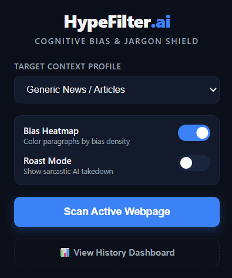
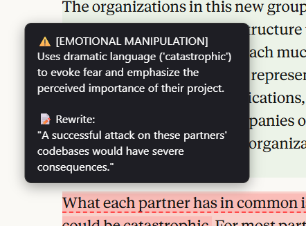
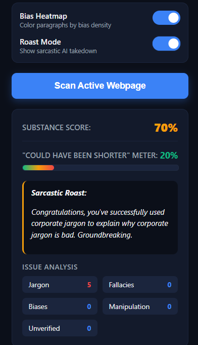
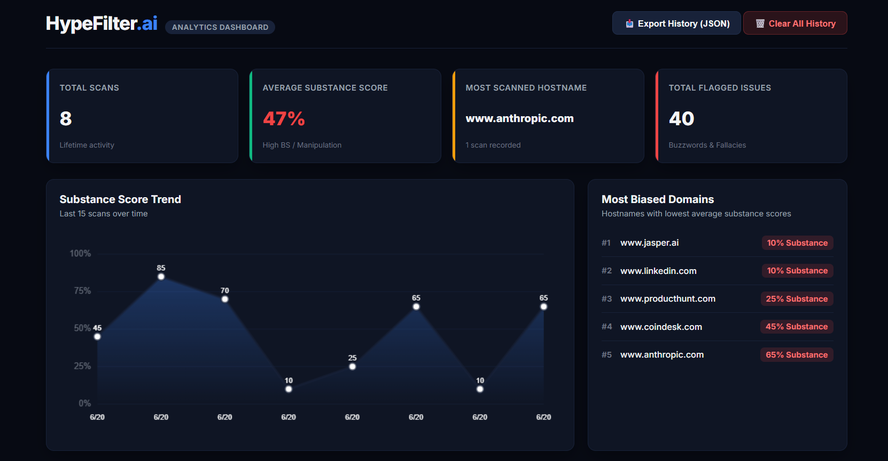

# HypeFiltr.ai ⚡

> A Chrome extension that scans any webpage in real time and calls out corporate jargon, logical fallacies, fake urgency, and unsourced claims — then gives you a Verdict Score.






---

## 🚨 What It Catches

- **Corporate jargon & empty buzzwords** — "circle back", "synergy", "leverage", "bandwidth"
- **Logical fallacies** — strawman, appeal to authority, slippery slope
- **Cognitive bias & emotional manipulation** — FOMO, fear triggers, fake social proof
- **Fake urgency** — "Act now!", "Limited time only!", countdown pressure
- **Unsourced claims** — "Studies show..." → *Which studies? No source found.*

Every offending phrase gets **underlined in real time**. Hover any underline → a brutally honest AI tooltip appears with a plain-English rewrite. Instantly.

> *"82% Substance. 18% Hype. Proceed with mild optimism."*

---

## 🚀 Features

### ⚡ Live Substance Score
Scans page text and gives an overall substance rating from 0% (pure hype) to 100% (highly factual and clear).

### 🌡️ Bias Heatmap Mode
Colors webpage paragraphs dynamically on a gradient (green → yellow → orange → red) based on the density of bias and jargon detected. See the problem at a glance.

### 🎯 Target Context Profiles
Switch modes depending on what you're reading:

| Mode | What It Does |
|------|-------------|
| 📰 Generic News / Articles | Flags unsourced claims & emotional framing |
| 💼 LinkedIn Corporate Hype | Maximum jargon detection, zero mercy |
| 🪙 Web3 / Crypto FOMO | Catches fake urgency & hype-driven manipulation |
| 🛒 Sales Copy / Landing Pages | Exposes pressure tactics & hollow promises |
| 🎓 Academic / Research Mode | Sniffs out logical fallacies & bad citations |
| ✍️ Editor Mode | Rewrites corporate fluff to plain English on hover |

### 📊 Analytics Dashboard
HypeFiltr.ai doesn't just scan pages — it remembers everything:

- Historical score trends across every page you've ever scanned (animated HTML5 Canvas chart)
- A domain leaderboard showing which sites are the most hype-filled *(Spoiler: LinkedIn is not innocent.)*
- Cumulative stats on every fallacy, jargon term & unverified claim you've bypassed
- A **"Could Have Been Shorter" Fluff Meter** *(because some posts are 800 words of nothing)*
- Paginated and searchable history archive
- One-click **Export Report** — download your full scan history as JSON

### 🔥 Roast Mode
Toggle it on and HypeFiltr.ai stops being polite.

> *"Congratulations, you've successfully used corporate jargon to explain why corporate jargon is bad. Groundbreaking."*

> *"This LinkedIn post used the word 'journey' four times. It was a Tuesday."*

---

## 🛠️ System Architecture

```
Layer 1 — Chrome Extension Frontend
  ├── content.js          DOM scraping, live underlines, hover tooltips, verdict badges
  ├── tooltip.css         Floating tooltip styles
  ├── popup.html/js/css   Extension popup, mode toggles, profile switcher

Layer 2 — Node.js Express Backend
  ├── /analyze endpoint   Handles API requests & text chunking for long articles
  └── Gemini LLM          Structured prompt engineering → strict JSON output

Layer 3 — Chrome Storage API
  └── Persists scan history & bias trends across sessions
```

---

## ⚙️ Installation & Setup

### Prerequisites
- Node.js v18+
- Chrome browser
- Gemini API key via OpenRouter

### 1. Clone the repo
```bash
git clone https://github.com/Lakshana-7/hypefilter-ai.git
cd hypefilter-ai
```

### 2. Start the backend
```bash
cd backend
npm install
npm start
```
Create a `.env` file inside `/backend` with:
```
GEMINI_API_KEY=your_openrouter_api_key
PORT=3000
```
Server runs at `http://localhost:3000`

### 3. Load the Chrome extension
1. Open Chrome → go to `chrome://extensions`
2. Enable **Developer Mode** (top right toggle)
3. Click **Load unpacked**
4. Select the `/extension` folder from this repo
5. Pin HypeFiltr.ai to your toolbar

### 4. Use it
1. Navigate to any webpage
2. Click the HypeFiltr.ai icon
3. Select your Target Context Profile
4. Hit **Scan Active Webpage**
5. Watch the underlines appear

---

## 💡 Tech Stack

| Layer | Tech |
|-------|------|
| Extension | Chrome Manifest V3, Vanilla JS, HTML5, CSS3 |
| UI Isolation | Shadow DOM API |
| Backend | Node.js, Express, dotenv, CORS, OpenRouter SDK |
| AI Core | Gemini LLM via OpenRouter |
| Data Viz | HTML5 Canvas (animated score charts) |
| Storage | Chrome Storage API |

---

## 📁 Project Structure

```
hypefilter-ai/
├── extension/
│   ├── manifest.json        # Manifest V3 config
│   ├── content.js           # DOM scanning + Shadow DOM UI injection
│   ├── background.js        # Service worker
│   ├── popup.html           # Extension popup UI
│   ├── popup.js             # Popup logic + profile switcher
│   ├── popup.css            # Popup styles
│   └── tooltip.css          # Floating tooltip styles
├── backend/
│   ├── server.js            # Express server + LLM proxy
│   ├── .env                 # API keys (never committed)
│   └── package.json
├── .gitignore
└── README.md
```

---

## 🔒 Security

- API keys are **never exposed client-side** — all LLM calls go through the Node.js backend proxy
- No user data is sent to third parties
- Scan history is stored locally via Chrome Storage API only

---

## 🗺️ Roadmap

- [ ] Firefox support
- [ ] Safari extension
- [ ] Weekly digest email of your bias trends
- [ ] Shareable Verdict Score cards
- [ ] Team / org-level dashboard
- [ ] Twitter / X rage-bait detection mode

---

## 🤝 Contributing

PRs are welcome. Open an issue first for major changes.

1. Fork the repo
2. Create a feature branch (`git checkout -b feature/your-feature`)
3. Commit your changes (`git commit -m 'add your feature'`)
4. Push to the branch (`git push origin feature/your-feature`)
5. Open a Pull Request

---

## 📄 License

MIT — do whatever you want with it, just don't use it to write hype.

---

## 👤 Author

Built solo by **Lakshana**
- LinkedIn: www.linkedin.com/in/lakshana-a-135494385
- GitHub: https://github.com/Lakshana-7

---

*"You don't just read the internet differently. You start to see the patterns."*
